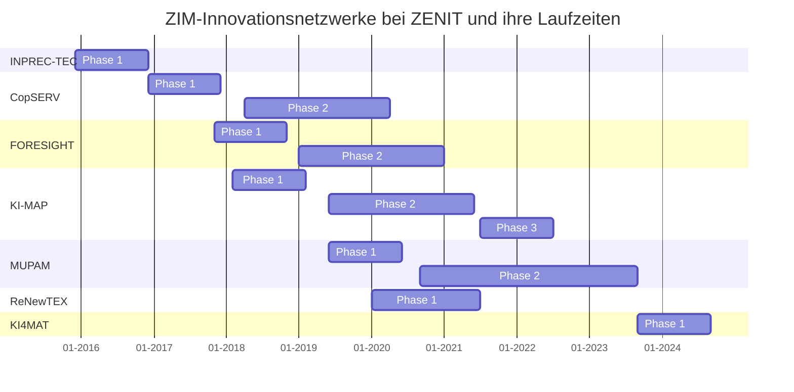

# Übersicht 

![[Pasted image 20231023172656.png]]

---
## INPREC-TEC - Innovationsnetzwerk Präzise Elektrochemische Metallbearbeitungstechnologien

**Start der Laufzeit:** Dezember 2015, **Team:** Peter Loef, Stefan Braun
Die Präzise Elektrochemische Metallbearbeitung (PECM) ist eine Fertigungstechnologie zur berührungslosen, hochgenauen Bearbeitung komplexer Bauteile und hochfester Werkstoffe. Sie ist mit zahlreichen Vorteilen wie einer präzisen Bearbeitung nahezu aller Metalle ohne Gefügeveränderung und thermische oder mechanische Einflüsse und hoher Abbildegenauigkeit verbunden. Derzeit ist die PECM-Technologie nicht weit verbreitet und kommt nur in einigen hochspezialisierten Anwendungen zum Einsatz. Ziel des Netzwerkes ist es, insbesondere KMU aus dem Formen- und Werkzeugbau sowie dem Maschinenbau den Zugang zur PECM-Technologie und die Nutzbarmachung ihres großen Potenzials zu ermöglichen. Die Entwicklungsschwerpunkte liegen insbesondere in der Erhöhung des Automatisierungsgrades der Bearbeitungsprozesse sowie vor- und nachgelagerter Prozesse und in der Entwicklung von Prüfverfahren zum Nachweis der Qualität. Zu den Anwendungsbereichen zählen u. a.unter anderem die Automobilindustrie, Luft und Raumfahrt, Medizintechnik, die Elektronikindustrie und die Umformtechnik.

## CopServ - Copernicus-Services und -Technologien für regionale und lokale branchenspezifische Dienste und Anwendungen

**Start der Laufzeit:** Dezember 2016, **Team:** Peter Loef, Simone Stangier
Ziel des Netzwerkes ist die Entwicklung und Vermarktung von Produkten, Anwendungen und Diensten auf Basis des satellitengestützten Erdbeobachtungsprogramms Copernicus. Hierzu sollen Unternehmen und Forschungseinrichtungen aus unterschiedlichen Bereichen wie Fernerkundung, Geoinformation, Sensortechnologien, Kommunikation, Big Data und Cloud-Services mit Anwenderbranchen wie Energie- und Wasserwirtschaft, Umwelt- und Naturschutz, Land- und Forstwirtschaft, Bergbau sowie der öffentlichen Hand zusammengebracht werden. Neben den Satellitendaten sollen insbesondere auch die sogenannten In-Situ-Daten (von lokalen und regionalen Systemen) für die Umsetzung von Copernicus-Diensten wie Land- und Umweltüberwachung, Katastrophenschutz oder Sicherheitsmanagement nutzbar gemacht werden. Dies soll unter anderem durch die Entwicklung von Datenschnittstellen und Kommunikationstechnik, Sensorsystemen und - netzen, webbasierten Datendiensten und branchenspezifischen Anwendungslösungen erfolgen.

## FOresIght - Funktionsintegration und neue Oberflächen für das Automobil-Interieur der Zukunft

**Start der Laufzeit:** November 2017, **Team:** Linda Claaßen, Claus Lüdtke, Sabine Widdermann, Uwe Birk
Zukünftige Mobilitätskonzepte (Elektromobilität, autonomes Fahren) verlangen nach deutlichen Veränderungen im Automobil-Interieur. Davon sind die deutschen Automobilhersteller überzeugt. Erste Konzepte dazu wurden auf großen Automobilmessen gezeigt. Die Designs und Produktanforderungen werden in der Regel bei den OEMs festgelegt und die Zulieferer der verschiedenen Ebenen müssen diese umsetzen. Das Netzwerk versammelt OEMs und Zulieferer aller Ebenen (Tier 1-4), um die benötigten Entwicklungen für neue Materialien, funktionale Oberflächen und deren Produktionstechnologien für das Automobil-Interieur zu forcieren. Der Austausch mit forschenden Akteuren des Netzwerks wird dazu beitragen, Entwicklungsideen aus den Laboren zu neuen Anzeige- und Bedienkonzepten, neuen Werkstoffen und funktionalisierten Oberflächen in umsetzungsorientierte Lösungen zu überführen. Die Möglichkeit der Funktions- und Materialentwicklungen soll aber nicht ausschließlich auf die Automobilzulieferindustrie beschränkt sein, sondern es sollen auch neue Marktsegmente erschlossen werden.

## KI-MAP - Künstliche Intelligenz und Maschinelles Lernen in Maschinen, Anlagen und Produktion

**Start der Laufzeit:** April 2018; **Team:** Stefan Braun, Michael Guth, Andrea Dohle, Sabine Widdermann  
Ziel des Kooperationsnetzwerks ist die Entwicklung von Technologien und Systemen für neuartige Produkte und Verfahren, basierend auf Methoden der Künstlichen Intelligenz, insbesondere des Maschinellen Lernens in Maschinen, Anlagen und Produktionsprozessen. Bei vielen fertigenden Produktionsprozessen treten noch immer Fehler auf, die zu Ausschuss oder Stillstandzeiten führen. Hier soll mit Hilfe Lernender Systeme Abhilfe geschaffen werden, so dass die Maschinen und Anlagen zunehmend in die Lage versetzt werden, Fehler selbst zu erkennen und dementsprechend zu agieren.

## MUPAM -  Multiplikative Produkte im Additive Manufacturing

**Start der Laufzeit:** Juni 2019; **Team:** Christian Bobisch, Marcel Spill  
In der additiven Fertigung sind die mechanischen Eigenschaften und die Oberflächengüte der gedruckten Produkte wesentliche Entwicklungsschwerpunkte, bei denen die Qualitätsmerkmale und Standards der konventionellen Fertigungstechniken noch nicht erreicht werden können. Das Netzwerk hat sich daher zum Ziel gesetzt diese Merkmale signifikant zu verbessern und darüber hinaus gezielte Modifikationen der Eigenschaften zu ermöglichen. Im Fokus der Entwicklungen stehen Druckkopf sowie Düsentechnologien, die differenzierbare Auflösungen bzw. Genauigkeiten innerhalb einzelner additiv gefertigter Bauteile realisieren können. Mithilfe dieser Komponenten sollen sowohl eine Erhöhung der Qualität an funktionalen Stellen erzielt werden, als auch Ressourcen optimiert eingesetzt werden können. Zusätzlich soll durch den Einsatz hybrider Materialstrukturen eine gezielte und ortsgenaue Funktionalisierung innerhalb einzelner Bauteile erreicht werden, um z. B.. Härteverläufe, andere gradierte Eigenschaften oder hochwertige Oberflächenschichten und -strukturen fertigen zu können.
   
## ReNewTex - Nachhaltige Kreislaufwirtschaft für faserbasierte Wertstoffe durch Informationstransparenz und dezentrale Recyclingnetzwerke in Hochlohnländern

**Start der Laufzeit:** Januar 2020, Laufzeit nur ein Jahr, Internationales ZIM-Kooperationsnetzwerk; **Team:** Karsten Lemke, Claus Lüdtke
Die Herstellung faserbasierter Produkte erfordert einen hohen Personalbedarf. Aktuelle Studien belegen, dass faserbasierte Abfälle aufgrund kürzerer Produktnutzungszeiten, falscher Entsorgung sowie des negativen Images von recycelten Faserrohstoffen ein erhebliches, weltweites Umweltproblem darstellen. Die übliche Einteilung der faserbasierten Abfälle in 200 Kategorien und 50 Materialgemische zeigt die hohe Komplexität der Sortierung sowie die daraus entstehenden Kosten deutlich. Vor diesem Hintergrund leben Diskussionen zur Kreislaufwirtschaft neu auf. Ziel des Netzwerks ist die Schaffung technischer und logistischer Grundlagen, um eine Kreislaufwirtschaft für faserbasierte Produkte aufzubauen. Die Gewährleistung der Informationstransparenz entlang des Produktlebenszyklus sowie der sich anschließenden Recyclingkette und die Sicherung konstanter Wertstoffströme stehen dabei im Fokus. Es soll im Rahmen des Netzwerks ein vollständiger, stoffschlüssiger Materialkreislauf am Beispiel textiler Bodenbeläge aufgebaut werden. Das internationale Netzwerk arbeitet mit KMU und Forschungseinrichtungen aus Belgien und den Niederlanden zusammen.

## KI4MAT

**Start der Laufzeit:** September 2033; **Team:** Stefan Braun, Christian Bobisch, Marcel Spill, Catherine Hartmann
Irgendwas mit KI und Legierungsentwicklung ;-)

